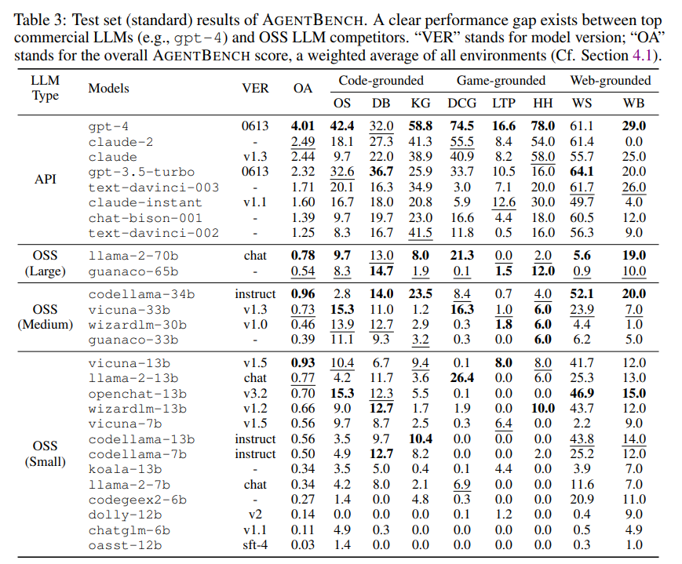
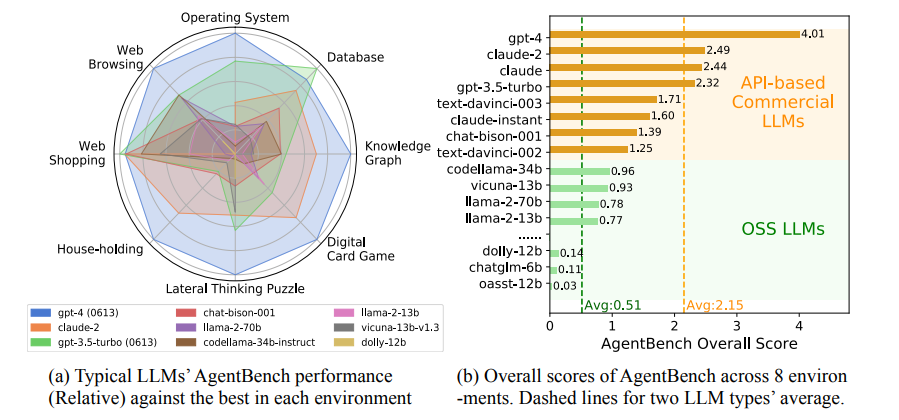

# AgentBench


<p align="center">
   <a href="https://llmbench.ai" target="_blank">🌐 官网</a> | <a href="https://twitter.com/thukeg" target="_blank">🐦 Twitter</a> | <a href="mailto:agentbench@googlegroups.com">✉️ Google Group</a> | <a href="https://arxiv.org/abs/2308.03688" target="_blank">📃 论文 </a> | <a href="README.md">🌏 English Version</a>
</p>

<p align="center">
👋 加入我们的 <a href="https://join.slack.com/t/agentbenchcol-huw1944/shared_invite/zt-20ixabcuv-31cFLBAkqGQxQkJqrWVEVg" target="_blank">Slack</a> 频道 <i>Q & A</i> 或者 <i><b>合作</b>下一个版本的AgentBench</i> !
</p>

## 📌AgentBench v0.2推出🎉

你现在正在浏览的是AgentBench v0.2版，如果你想使用旧版，你可以回到[v0.1](https://github.com/THUDM/AgentBench/tree/v0.1)版。

在[v0.1](https://github.com/THUDM/AgentBench/tree/v0.1)版本的基础上，我们：
- 更新了框架架构，更容易使用和扩展
- 调整了部分任务设定
- 加入了更多模型的测试结果
- 推出了Dev和Test集的全部数据

# AgentBench: Evaluating LLMs as Agents

https://github.com/THUDM/AgentBench/assets/129033897/656eed6e-d9d9-4d07-b568-f43f5a451f04

**AgentBench** 是第一个旨在评估 **LLM-as-Agent**
在各种不同环境中的表现的基准测试。它包括8个不同的环境，以更全面地评估LLMs在各种场景中作为自主代理的能力。这些环境包括5个新创建的领域，分别是

- Operating System (OS)
- Database (DB)
- Knowledge Graph (KG)
- Digital Card Game (DCG)
- Lateral Thinking Puzzles (LTP)

以及三个来自公开数据集并被我们重新设计的:

- House-Holding (HH) ([ALFWorld](https://github.com/alfworld/alfworld))
- Web Shopping (WS) ([WebShop](https://github.com/princeton-nlp/webshop))
- Web Browsing (WB) ([Mind2Web](https://github.com/OSU-NLP-Group/Mind2Web))


## 目录

- [数据集介绍](#数据集介绍)
- [主要结果](#主要结果)
- [快速上手](#快速上手)
- [下一步骤](#下一步骤)
- [引用我们的工作](#引用)

## 数据集介绍

我们提供两种数据集划分：Dev和Test。分别大约需要4k和13k轮推理。


## 主要结果

这里是AgentBench标准测试集（Test set）上的结果。



尽管LLMs开始展现出它们在LLM-as-Agent中的一些初步能力，但模型之间的差距以及距离实际可用性的鸿沟都是巨大的。



## 预备工作

安装依赖。

```bash
pip install -r requirements.txt
```

另外你还需要确保docker已经正确安装。并且本地有`mysql`和`ubuntu`的镜像。

## 快速上手

这一节将介绍如何快速使用gpt-3.5-turbo-0613作为agent启动`dbbench-std``os-std``kg-std`三个任务。
具体框架结构请参阅[框架介绍](docs/Introduction_cn.md)。
对于更详细的配置方式和启动方式请参阅[配置介绍](docs/Config_cn.md)和[程序入口介绍](docs/Entrance_cn.md)。

### 配置Agent

将你的OpenAI API Key填写到`configs/agents/openai-chat.yaml`中的正确位置。

你可以尝试使用`python -m src.client.agent_test`来检查你的Agent是否正确配置。

### 启动task server

task worker的启动涉及具体任务，手动启动可能存在一些麻烦，因此我们提供了自动化脚本。

这一步的假设是端口从5000至5015都有空余。

```bash
python -m src.start_task -a
```

这一步会启动`dbbench-std``os-std``kg-std`三个任务每个各五个的task_worker并使其自动连接到5000端口的controller。

### 启动assigner

这一步骤是真正开始运行任务。

如果以上都正确配置，则此时可以启动任务的测试了。

```bash
python -m src.assigner
```

## 下一步骤

如果你想启动更多的任务或者使用别的模型，你可以参考[配置介绍](docs/Config_cn.md)和[程序入口介绍](docs/Entrance_cn.md)中的内容。

剩下五个任务的环境皆需要下载我们提供的docker镜像。

```
longinyu/agentbench-ltp
longinyu/agentbench-webshop
longinyu/agentbench-mind2web
longinyu/agentbench-card_game
longinyu/agentbench-alfworld
```

八个任务单个task_worker大致的资源消耗如下，启动时酌情考虑：

| 任务名称      | 启动速度  | 内存消耗   |
|-----------|-------|--------|
| webshop   | ~3min | ~15G   |
| mind2web  | ~5min | ~1G    |
| db        | ~20s  | < 500M |
| alfworld  | ~10s  | < 500M |
| card_game | ~5s   | < 500M |
| ltp       | ~5s   | < 500M |
| os        | ~5s   | < 500M |
| kd        | ~5s   | < 500M |

## 引用

```
@article{liu2023agentbench,
  title   = {AgentBench: Evaluating LLMs as Agents},
  author  = {Xiao Liu and Hao Yu and Hanchen Zhang and Yifan Xu and Xuanyu Lei and Hanyu Lai and Yu Gu and Hangliang Ding and Kaiwen Men and Kejuan Yang and Shudan Zhang and Xiang Deng and Aohan Zeng and Zhengxiao Du and Chenhui Zhang and Sheng Shen and Tianjun Zhang and Yu Su and Huan Sun and Minlie Huang and Yuxiao Dong and Jie Tang},
  year    = {2023},
  journal = {arXiv preprint arXiv: 2308.03688}
}
```
